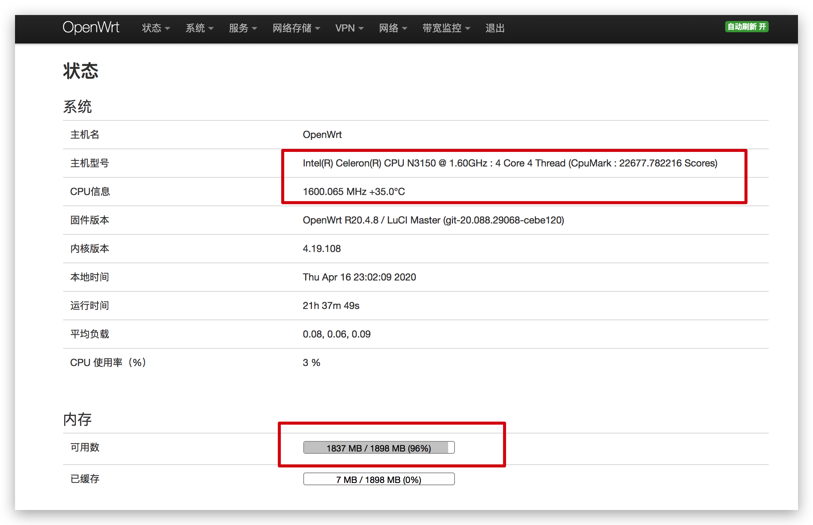
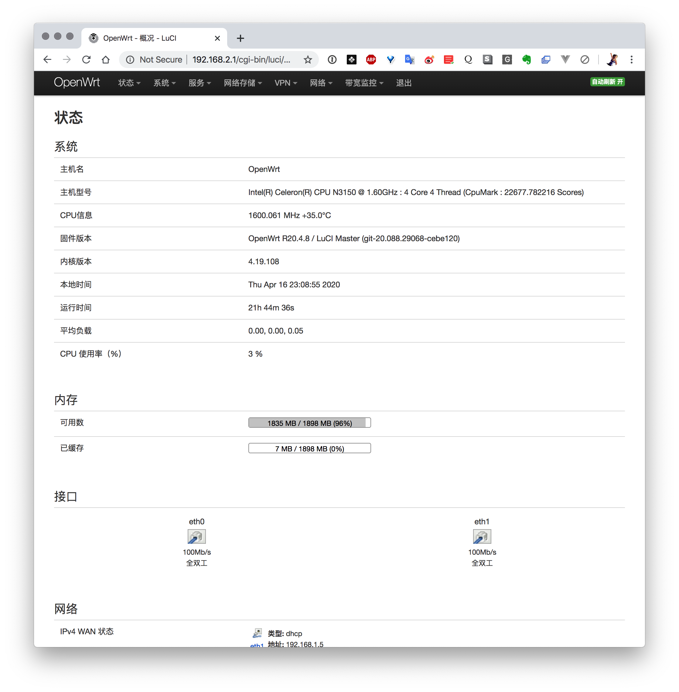
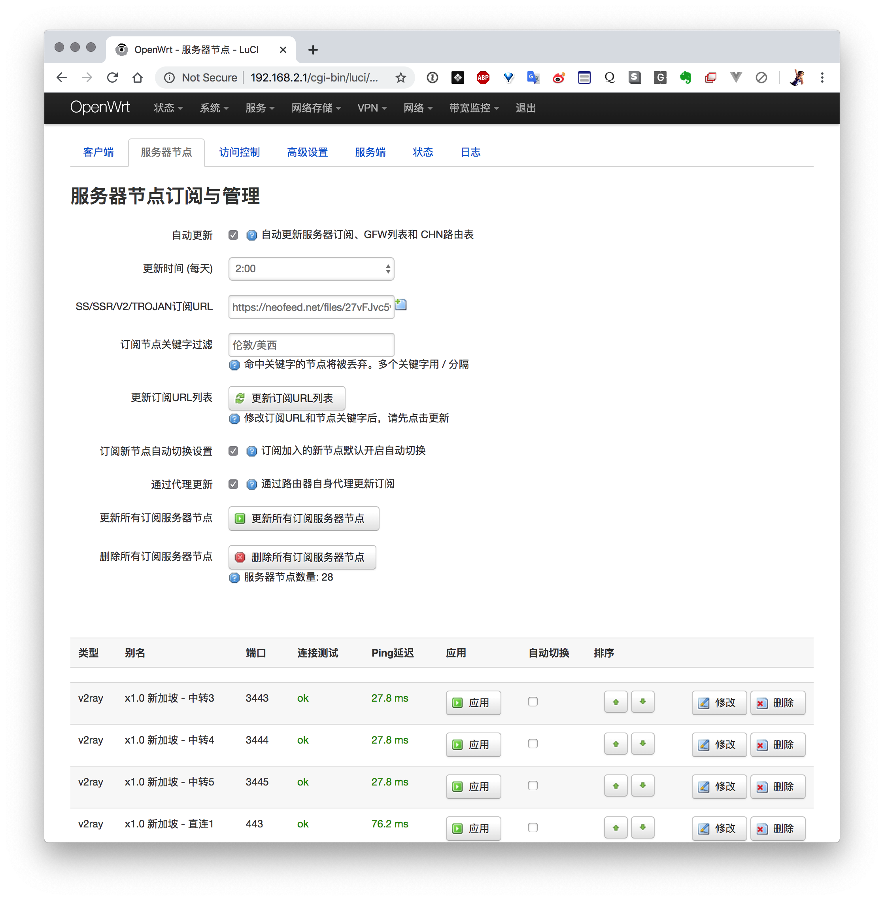
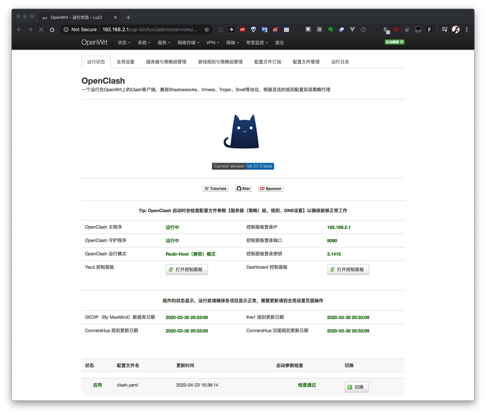
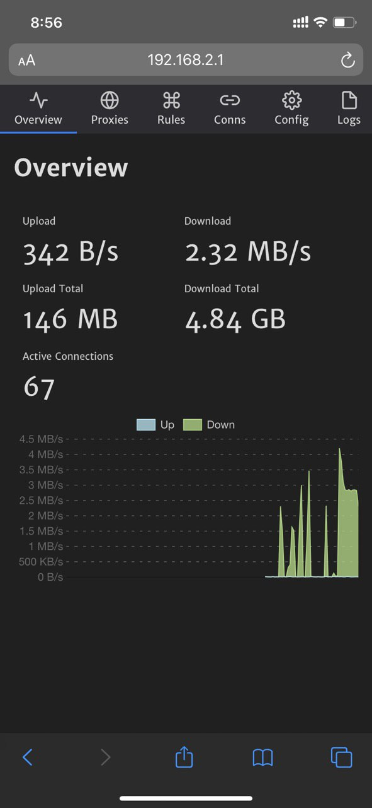
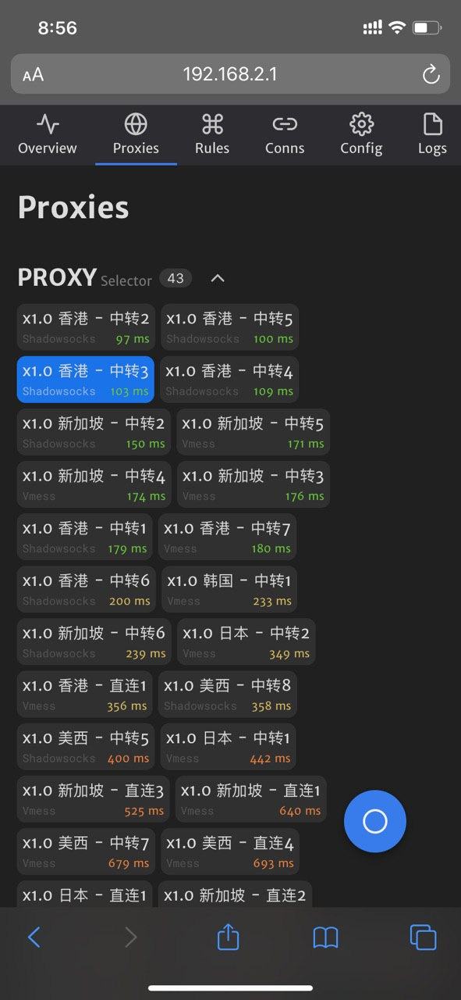
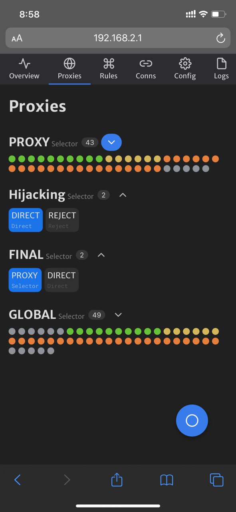
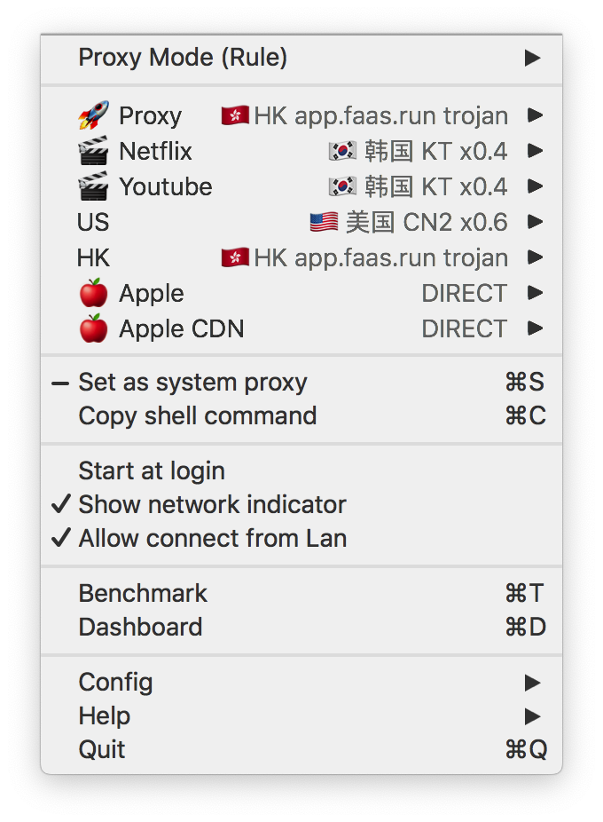
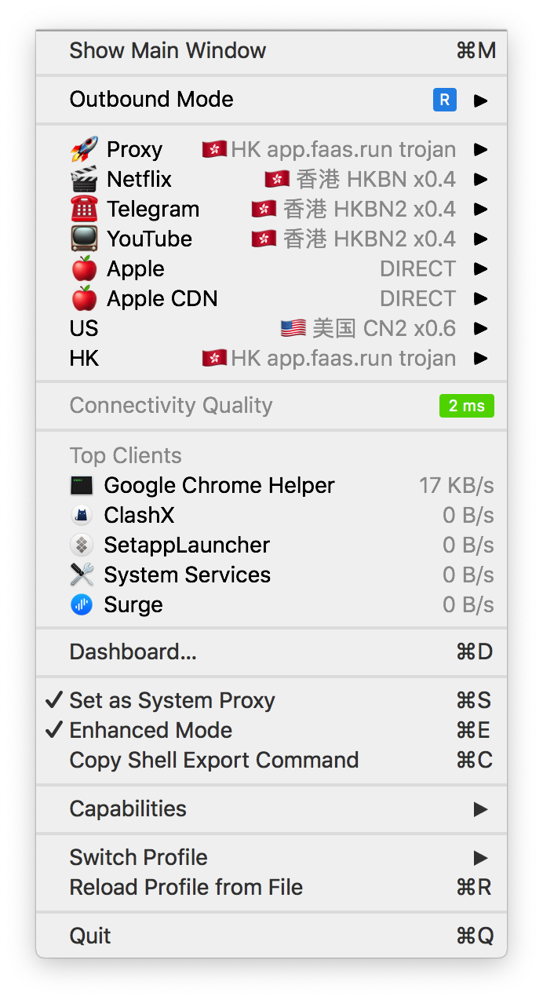

# 科学上网方案分享

---

# Topic

* 一些服务
* 服务端协议工具
* app(surge, shadowrocket, quantumaul)
* openwrt/软路由

---

# 我的openwrt/软路由

---

# 硬件

---


---



---

# 软件openwrt

```
BusyBox v1.30.0 () built-in shell (ash)

  _______                     ________        __
 |       |.-----.-----.-----.|  |  |  |.----.|  |_
 |   -   ||  _  |  -__|     ||  |  |  ||   _||   _|
 |_______||   __|_____|__|__||________||__|  |____|
          |__| W I R E L E S S   F R E E D O M
 -----------------------------------------------------
 OpenWrt SNAPSHOT, r0-8a02b49
 -----------------------------------------------------
 ```

---

## 最开始用 KoolShare的

http://firmware.koolshare.cn/

## 现在换成了

https://github.com/coolsnowwolf/lede

---




---

# 用的插件是 ShadowSocksR Plus+ 和 OpenClash

* ShadowSocksR Plus+  支持SS/SSR/V2RAY/TROJAN/SOCKS5/TUN
* openclash A Clash Client For OpenWrt
* openclash Github https://github.com/vernesong/OpenClash

---

ShadowSocksR Plus+ 



---

OpenClash



---

yard



---


# build

aliyun开个ubuntu构建或者使用 GitHub Action 构建

* 使用 GitHub Actions 云编译 OpenWrt https://p3terx.com/archives/build-openwrt-with-github-actions.html
* 脚本 https://github.com/P3TERX/Actions-OpenWrt
* 我编译的 https://github.com/lidashuang/OpenWrt-Build/actions/runs/78218011

---

# write image

1. dd openwrt镜像到u盘启动
2. 再在openwrt里dd openwrt的image到工控机硬盘

dd example

```bash
root@Openwrt:~# dd if=./openwrt-x86-64-combined-squashfs.img of=/devsdb1
```


---

# 非路由器方案

---

# MacOS

---

>  Surge
> Advanced Network Toolbox for Mac & iOS
-- https://nssurge.com/

---

> ClashX
> A rule based proxy For Mac base on Clash.
-- https://github.com/yichengchen/clashX/tree/master

---

# ClashX & Surge 

 

---

# iOS

--- 

## surge & shadowrocket & Quantumault x 

  

---

# Android

---

### surfboard


---

# 配置管理

---

> surgio
> 一站式各类代理规则生成器
-- https://surgio.royli.dev/


---
## Surgio 适合谁？

* 购买了两个以上的 「机场」
* 使用了两个以上的代理软件
* 对机场提供的规则不满意
* 会写点 JavaScript

---

## Surgio 方便的地方

* 各种filter 
* 导出不同app的配置 
* 可以导出到oss, 配合订阅

--- 

# 自建方案推荐

---

# 阿里云 或者 阿里云国际版

📢📢📢 [卸载阿里云盾（安骑士](https://github.com/stardock/aliyun-service)


--- 

# 服务端方案

* 推荐 [trojan](https://github.com/trojan-gfw/trojan)
* [v2ray](https://www.v2ray.com/) [一键安装](https://github.com/233boy/v2ray/wiki/V2Ray%E4%B8%80%E9%94%AE%E5%AE%89%E8%A3%85%E8%84%9A%E6%9C%AC)

